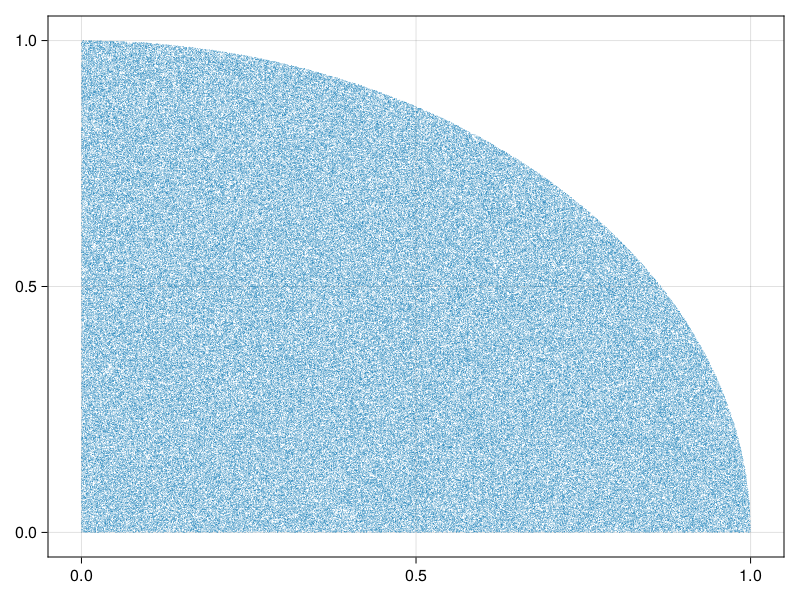

# Generating Structs

While we can get pretty far with generating basic types like `Int` or `String`, sometimes we need to make additional guarantees
or don't need to generate the full spectrum of possible values for a type, or need something more specific than what `itype`
gives us. In these cases, we can create our own shrinker, by `map`ing, `filter`ing and `interleave`ing existing integrated shrinkers.

## `map`

Suppose we have a type that can only hold even numbers. If we try to give it an odd number, it will throw an error on construction:

```@example mapNum
struct EvenNumber
    val::Int
    function EvenNumber(v)
        iseven(v) || throw(ArgumentError("Argument '$(v)' is not an even number!"))
        new(convert(Int, v))
    end
end
```

If we try to check that this type truly can only hold even numbers, we can do it like so:

```@repl mapNum
function even_construction(x)
    try
        v = EvenNumber(x)
    catch e
        err = ArgumentError("Argument '$x' is not an even number!")
        return e == err && isodd(x)
    end
    return true
end
using PropCheck
check(even_construction, itype(Int8))
```

So far so good. But what now if we want to test some code that relies on this even number, and we don't care for testing
whether the construction works in the first place? Naively, we can construct an integrated shrinker creating instances of `EvenNumber`
like so:

```@repl mapNum
iEvenNumThrowing = map(EvenNumber, itype(Int8));
```

but this has the issue that creating objects of `EvenNumber` would try to create invalid instances, and throw an error:

```@example mapNum
try
    # it's a 50/50 chance of throwing - this ought to be enough samples
    for _ in 1:100_000
        generate(iEvenNumThrowing)
    end
catch e
    e
end
```

We can work around this by `map`ing not only our constructor, but also by crafting the input to `EvenNumber` in such a way as to never trigger the error:

```@repl mapNum
iEvenNum = map(itype(Int8)) do i
    EvenNumber(div(i,2)*2)
end;
check(iEvenNum) do en
    iseven(en.val)
end
```

This pattern can be extended indefinitely; the return type of `map` can itself be `map`ed again, as it produces another integrated shrinker.

## `filter`

While `map` is useful for cases where we can transform some invalid input into a valid one, `filter` can be used for rejecting some set of values entirely.

Consider this:

```@repl filterCirc
using PropCheck
i0to1 = isample(0:0.00001:1.0);
iquadr = filter(PropCheck.tuple(iconst(2), i0to1)) do tup
    sqrt(tup[1]^2 + tup[2]^2) <= 1
end;
```

We first define a generator for sampling numbers from `0.0:0.00001:1.0`, and use that to create `Tuple{Float64,Float64}`
consisting of coordinates in the first quadrant of the unit circle. Let's confirm that this is the case:

```@repl filterCirc
check(iquadr) do coords
    sqrt(coords[1]^2 + coords[2]^2) <= 1
end
```

And sure enough, the trivial property holds - we filtered for it after all. What if we now want to
filter for a band of values, for example an arch with outer radius `1.0` and inner radius `0.8`?
This rejects a large portion of (so far) legal values:

```@repl filterCirc
iarch = filter(iquadr) do tup
    sqrt(tup[1]^2 + tup[2]^2) >= 0.8 
end;
try
    for _ in 1:100_000
        generate(iarch)
    end
catch e
    e
end
```

Even just trying to generate such a value, with naive filtering, leads to a stackoverflow, or worse,
close to infinite loops. This is because `filter` tries to be optimistic - when it encounters a value that doesn't
match its filter criterion, it tries the shrinks of that value as well. In the case of our donut shaped
filtering combination, this tries a huge number of additional examples that we know we can reject outright,
because their shrinks can never be valid outputs; once the distance from the origin of a point is less than
`0.8`, any shrinks of those coordinates must be closer to the origin yet again, making the shrunk coordinates
trivially rejectable. To communicate this to `filter`, we can pass a third argument `trim`, steering whether
`filter` should trim shrinks of a rejected value entirely or not:

```@repl filterCirc
iarch = filter(iquadr, true) do tup
    sqrt(tup[1]^2 + tup[2]^2) >= 0.8 
end;
generate(iarch)
```

### Bias

Even though the returned numbers lie in our desired band, they are _biased_ because our first filtering
step did not reject shrinks, but instead tried them as well. This results in clumping of values:


This can be easily fixed, by just trimming the values of the first generator as well, resulting in this distribution:

```julia
iquadrUnbias = filter(PropCheck.tuple(iconst(2), i0to1), true) do tup
    sqrt(tup[1]^2 + tup[2]^2) <= 1
end
```



The plots were produced with this script:

```julia
using CairoMakie
pointsBias = [ root(generate(iquard)) for _ in 1:500_000 ]
pointsUnbias = [ root(generate(iquardUnbias)) for _ in 1:500_000 ]
scatter(pointsBias; markersize=0.8)
scatter(pointsUnbias; markersize=0.8)
```

This bias may not be an issue in every applicable situation, but should be considered in general. Do note that this only shows the first level of produced values; the shrinking function may
introduce another layer of bias not shown here.

### Considerations when using `filter`

Filtering comes at an additional cost - due to the nature of `filter`, it may reject all produced values and exhaust the generator, which ends up producing `Nothing`. 
As such, `filter` may not return any values at all, introducing a type instability.

Further, because `filter` needs to attempt to generate a value before it can decide whether or not the value needs to be filtered out, you may encounter
additional overhead if the set of values that could be generated is close to the set of values that are rejected. I.e., if you reject most of the values
generated by a generator as in the `idonut` example above, it is usually better to try to construct your values such that they don't need to be filtered in the first place, instead of
filtering after the fact. In the example shown above, it would have been better to generate values from
`isample(0.8:0.00001:1.0)` in the first place. Filtering really should only be a last resort.

In some cases, such as when sampling a `PropCheck.vector` from an `isample(3:8)`, filtering can't be avoided, because the
generated `Vector`s need to have a length of at least `3`.

## `interleave`

We've seen so far how to generate plain values from types, create simple structs, as well as filter & map functions
over integrated shrinkers. Now, let's take a look at how to create more complicated objects implicitly, with `interleave`.

Consider this struct:

```@example interExamp
using PropCheck

struct Person
    name::String
    age::Int
    height::Int
    favorite_color::String
    function Person(name::String, age::Int, height::Int, favorite_color::String)
        age < 0 && throw(ArgumentError("`age` must be a positive `Int`!"))
        height < 0 && throw(ArgumentError("`height` must be a positive `Int`!"))
        new(name, age, height, favorite_color)
    end
end
```

How might we construct objects of this type? We know that there's at least one constructor, the three-arg `Person`, which ensures that we can only create `Person` objects that satisfy our criteria.
Naively, we need at least a 4-tuple of values that we could splat into `Person`, like `Person(("Agnes", 26, 178, "Violet")...)` and we know that we could create such a tuple with
`type(Tuple{String,Int,Int,String})`, but this has a few issues:

 * We'd have to filter out or `map` any tuples that have an age or height less than `0` manually.
 * We have no control over the exact `name` and `favorite_color` strings.
 * We have no control over the shrinking of each field; We may want to create a generator that doesn't shrink the persons name, for example.

Let's first define some generators we might want to use for the individual fields, starting out with `age` and `height`:

```@repl interExamp
iage = isample(0:125); # the oldest living person at time of writing is 116; the oldest recorded was 122
iheight = isample(0:300); # 3 meters is a reasonable maximum
```

For the name, we'd like to sample from a pool of names (though depending on what we want to test, we may want to generate arbitrary unicode instead, to check that we're handling it correctly!)
and we'd also like to prevent shrinking of the name. Sampling from a pool of names can be done with `isample`, just as with `age` and to prevent shrinking we can pass `PropCheck.noshrink`,
which just returns an empty list, indicating no shrinks, as the shrinking function:

```@repl interExamp
names = ["Agnes", "Bert", "Charlie", "Diana", "Emma", "Fredrick", "Ruby"]
iname = isample(names, PropCheck.noshrink);
```

Similarly, we'd like to sample their favorite colours and not shrink them as well:

```@repl interExamp
colours = ["Red", "Blue", "Green", "Yellow", "Beige",
           "Ruby", "Amber", "Crystal", "Dark Blue", "Ivory"];
icolor = isample(colours, PropCheck.noshrink);
```

On their own, these generators simply create their usual objects:

```@repl interExamp
generate(iage)
generate(iheight)
generate(iname)
generate(icolor)
```

with `iname` and `icolor` of course having no shrinks:

```@repl interExamp
generate(iname) |> subtrees |> isempty
generate(icolor) |> subtrees |> isempty
```

We can combine these individual integrated shrinkers into one by using the `interleave` function, which returns an integrated shrinker that produces tuples of the passed in values:

```@repl interExamp
iargs = interleave(iname, iage, iheight, icolor);
generate(iargs)
```

To now build a person from all these ingredients, all we need to do is splat that generated tuple into our constructor:

```@repl interExamp
iperson = map(splat(Person), iargs);
generate(iperson)
```

which we can of course use to check some property:

```@repl interExamp
check(iperson; ntests=10_000) do p
    if p.name == p.favorite_color
        p.age < 22
    else
        true
    end
end
```

Returning the only combination of `names` and `colours` that matches; `Person("Ruby", 22, 0, "Ruby")`, who
rightfully didn't let anyone tell her that her favorite color can't be the same as her name.

Note how `interleave` managed to shrink both the age, as well as the height from the initial counterexample.
This is the strength of `interleave`, compared to just naively generating the the arguments one-by-one and
constructing the object manually, instead of letting PropCheck do it for you.
